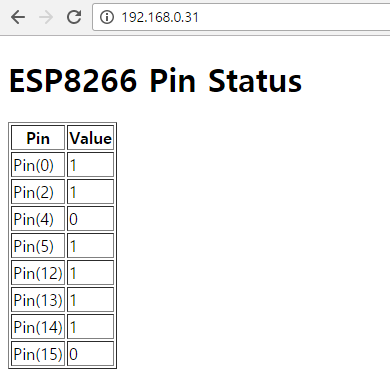

# Simple Http Server Test

## Test Method
1. Run following code first to (or put in your boot.py file) to automatically connect to your WiFi network:
```Python
def do_connect():
    import network
    sta_if = network.WLAN(network.STA_IF)
    if not sta_if.isconnected():
        print('connecting to network...')
        sta_if.active(True)
        sta_if.connect('<essid>', '<password>')
        while not sta_if.isconnected():
            pass
    print('network config:', sta_if.ifconfig())

do_connect()    
```

2. Networking setting for nodeMCU: Shoud know IP address of nodeMCU.
3. Run web browser
4. Enter http://IP_address (In my case: http://192.168.0.31)
5. Then, we will see following result:



* Value of Pin is depend your board state.

## Reference
1. [Network setting to connect to your WiFi network](
http://docs.micropython.org/en/latest/esp8266/esp8266/tutorial/network_basics.html)
2. [Micropython network — network TCP](http://docs.micropython.org/en/latest/esp8266/esp8266/tutorial/network_tcp.html)
