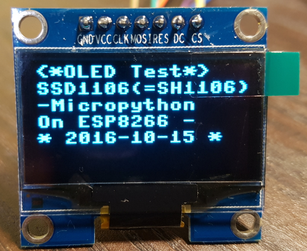

# OLED Display Test

## H/W information
1. [SSD1106 (SH1106) OLED Display: SPI version](https://www.aliexpress.com/item/1-3-inch-Blue-OLED-Module-SSD1106-Drive-IC-Compatible-with-SSD1306-IC-128-64-IIC/32655103082.html?spm=2114.13010608.0.0.z5nQe4)

- comment: SSD1106 and SH1106 are same.
- SSD1306 and SSS1106 are different.



2. Wire connection & SPI setting code

- Wire connection information

| nodeMCU Pin| ESP8266 Pin (GPIO)| SSD1106 OLED Display |
| --------|-------|-----|
| D1      | GPIO 05  | RES (Reset) |
| D2      | GPIO 04  | DC (DC)|
| D5      | GPIO 14  | CLK(SPI_CLK) |
| D7      | GPIO 13  | MOSI(SPI_MOSI)|
| D8      | GPIO 15  | CS(SPI_CS)|

- SPI setting code
```Python
class nodeMCU:
    #nodeMCU: ESP8266 Chip
    D0 = 16
    D1 = 5
    D2 = 4   
    D3 = 0   #Flash button
    D4 = 2   #built-in LED
    D5 = 14  #SPI_CLK
    D6 = 12  #SPI_MISO
    D7 = 13  #SPI_MOSI
    D8 = 15  #SPI_CS
    D9 = 3   #RXD0
    D10 = 1  #TXD0
    A0 = 0   #ADC0

#spi = SPI(mosi=Pin(13, Pin.OUT), sck=Pin(14, Pin.OUT))
#display = ssd1106.SSD1106(spi=spi, dc=Pin(4, Pin.OUT), rst=Pin(5, Pin.OUT), cs=Pin(15, Pin.OUT))

spi = SPI(mosi=Pin(nodeMCU.D7, Pin.OUT), sck=Pin(nodeMCU.D5, Pin.OUT))
display = ssd1106.SSD1106(spi=spi, dc=Pin(nodeMCU.D2, Pin.OUT), rst=Pin(nodeMCU.D1, Pin.OUT), cs=Pin(nodeMCU.D8, Pin.OUT))
```


## OLED Driver information
1. Original driver version of SSD1106(SH1106) is as follows:
- For ESP8266
 [https://bitbucket.org/thesheep/micropython-ili9341/src/tip/sh1106.py?fileviewer=file-view-default](
https://bitbucket.org/thesheep/micropython-ili9341/src/tip/sh1106.py?fileviewer=file-view-default)
- For pyboard
 [https://github.com/JonHylands/ssd1106](https://github.com/JonHylands/ssd1106)


2. The function of 'init_display(self)' is added for the SSD1106 (SH1106) OLED Display

```Python
def init_display(self):
    for cmd in (
	DISPLAYOFF,
        MEMORYMODE,
        SETHIGHCOLUMN, 0xB0, 0xC8,
        SETLOWCOLUMN, 0x10, 0x40,
        SETCONTRAST, 0x7F,
        SETSEGMENTREMAP,
        NORMALDISPLAY,
        SETMULTIPLEX, 0x3F,
        DISPLAYALLON_RESUME,
        SETDISPLAYOFFSET, 0x00,
        SETDISPLAYCLOCKDIV, 0xF0,
        SETPRECHARGE, 0x22,
        SETCOMPINS, 0x12,
        SETVCOMDETECT, 0x20,
        CHARGEPUMP, 0x14,
        DISPLAYON):
        self._write(cmd)
    self.fill(0)
    self.show()
```

## Reference
1. SH1106 OLED Display Driver for ESP8266
- [SH1106 Driver](
https://hackaday.io/project/11660-various-micropython-libraries-and-drivers/log/41993-sh1106-oled-display)
- [Original Code for SH1106](
https://bitbucket.org/thesheep/micropython-ili9341/src/tip/sh1106.py?fileviewer=file-view-default)
2. SSD1106 OLED Display Driver for pyboard
- [Source code ](https://github.com/JonHylands/ssd1106)
