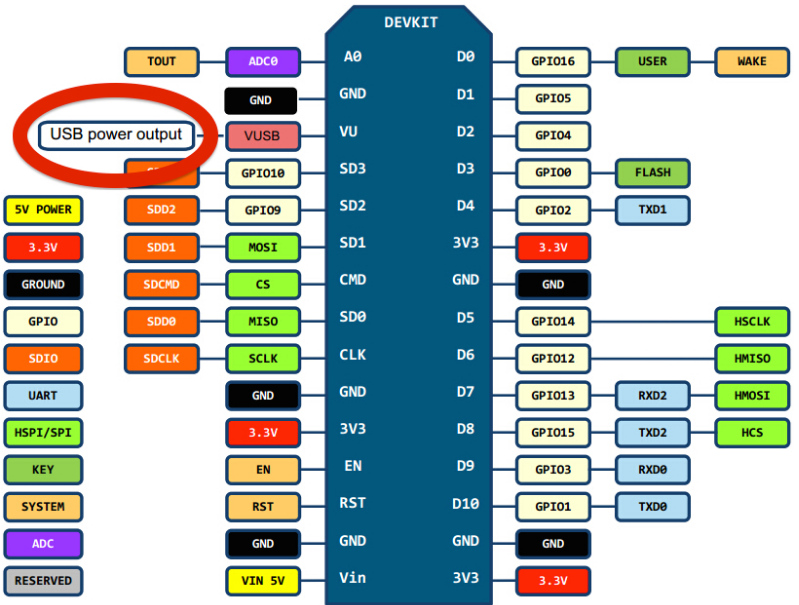

# ESP8266_nodeMCU_Micropython
Micropython code for nodeMCU(ESP8266 board)

This is my Micropython test code for nodeMCU(ESP8266-based)

Followings are my board and firmware settings.

## 1. Board:

[nodeMCU(LoLin)](http://www.banggood.com/V3-NodeMcu-Lua-WIFI-Development-Board-p-992733.html)

## 2. Pin Map
### nodeMCU Board & ESP8266 Pin Map

### Summary: NodeMCU Board, ESP8266 IO Map

| nodeMCU Pin| ESP8266 Pin (GPIO)| Function |
| --------|-------|-----|
| D0      | GPIO 16  | GPIO |
| D1      | GPIO 05  | GPIO |
| D2      | GPIO 04  | GPIO |
| D3      | GPIO 00  | GPIO, Flash |
| D4      | GPIO 02  | GPIO, Built-in LED, TXD1|
| D5      | GPIO 14  | GPIO |
| D6      | GPIO 12  | GPIO |
| D7      | GPIO 13  | GPIO, RXD2|
| D8      | GPIO 15  | GPIO, TXD2|
| D9      | GPIO 03  | GPIO, RXD0|
| D10     | GPIO 01  | GPIO, TXD0|
| A0      | A0       | Analog Input |

## 3. Downaload Micropython Firmware
- Visit Micropython Firmware site [https://micropython.org/download/#esp8266](https://micropython.org/download/#esp8266)
- Select the latest stabel version
(ex. esp8266-20160909-v1.8.4.bin (latest))

## 4. Download NodeMCU Flasher (Firmware Downloader)
- Connect the nodeMCU board to PC (Maybem you need to install USB-to-Serial driver)
- NodeMCU Flashing tool (select 32bit or 64bit according to your windwos) [https://github.com/nodemcu/nodemcu-flasher](https://github.com/nodemcu/nodemcu-flasher)

## 5. Download Micropython firmware using Flashing tool
- run 'ESP8266Flasher.exe'

- Config -> Select firmware

- Select firware file (addres: 0x00000 [default setting])

- Click 'Flash(F)' --> Start download

- Reset the nodeMCU board after finishing download

## 6. Connect serial terminal
- When you connect serial terminal, you can see following result.

## 7. Enjoy Python on embedded system (NodeMCU)
- Now, you can use mircopyhon on NodeMCU.

