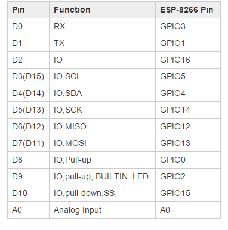
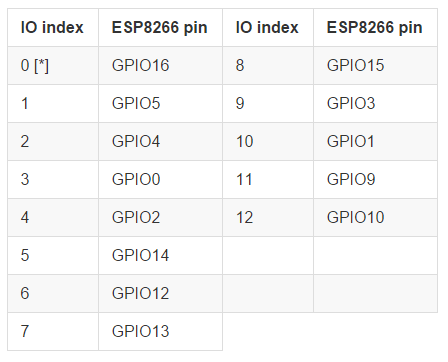

# ESP8266_nodeMCU_Micropython
Micropython code for nodeMCU(ESP8266 board)

This is my test code for nodeMCU-based ESP8266

Followings are my board and firmware settings.

## 1. Board: [WeMos D1](http://www.wemos.cc/wiki/doku.php?id=en:d1)

## 2. Pin Map
### WeMos D1 Board & ESP8266 Pin Map

### ESP8266 & NodeMCU IO Map

### Summary: WeMos D1 Board, ESP8266 & NodeMCU IO Map Map

| WeMos D1 Pin     | Function          | ESP8266 Pin | NodeMCU |
| ------- |:-------------------------:| -----:|-----:|
| D0      | Rx (Serial)                 | GPIO3  | 9 |
| D1      | Tx (Serial)                 | GPIO1  | 10 |
| D2      | GPIO                        | GPIO16 | 0 |
| D3(D15) | GPIO, SCL                   | GPIO5  | 1 |
| D4(D14) | GPIO, SDA                   | GPIO4  | 2 |
| D5(D13) | GPIO, SCK                   | GPIO14 | 5 |
| D6(D12) | GPIO, MISO                  | GPIO12 | 6 |
| D7(D11) | GPIO, MOSI                  | GPIO13 | 7 |
| D8      | GPIO, Pull-up               | GPIO0  | 3 |
| D9      | GPIO, Pull-up, Built-in LED | GPIO2  | 4 |
| D10     | GPIO, Pull-down, SS         | GPIO15 | 8 |
| A0      | Analog Input                | A0     | . |

## 3. Firmware
### Download 1
- 'nodemcu\_float\_0.9.6-dev\_20150704.bin' in
[NodeMCU Firwware](https://github.com/nodemcu/nodemcu-firmware/releases)
- Baudrate: 9600bps

### Download 2
- Online build in [http://nodemcu-build.com/](http://nodemcu-build.com)
- You can select modules and receive it from e-mail.

## 4. NodeMCU Flasher (Firmware Downloader)
- Download and install NodeMCU Flasher for Windows in [http://www.14core.com/downloads-2/](http://www.14core.com/downloads-2/)

## 5.ESPlorer (NodeMCU IDE)
- Download and install ESPlorer in [http://www.14core.com/downloads-2/](http://www.14core.com/downloads-2/)

